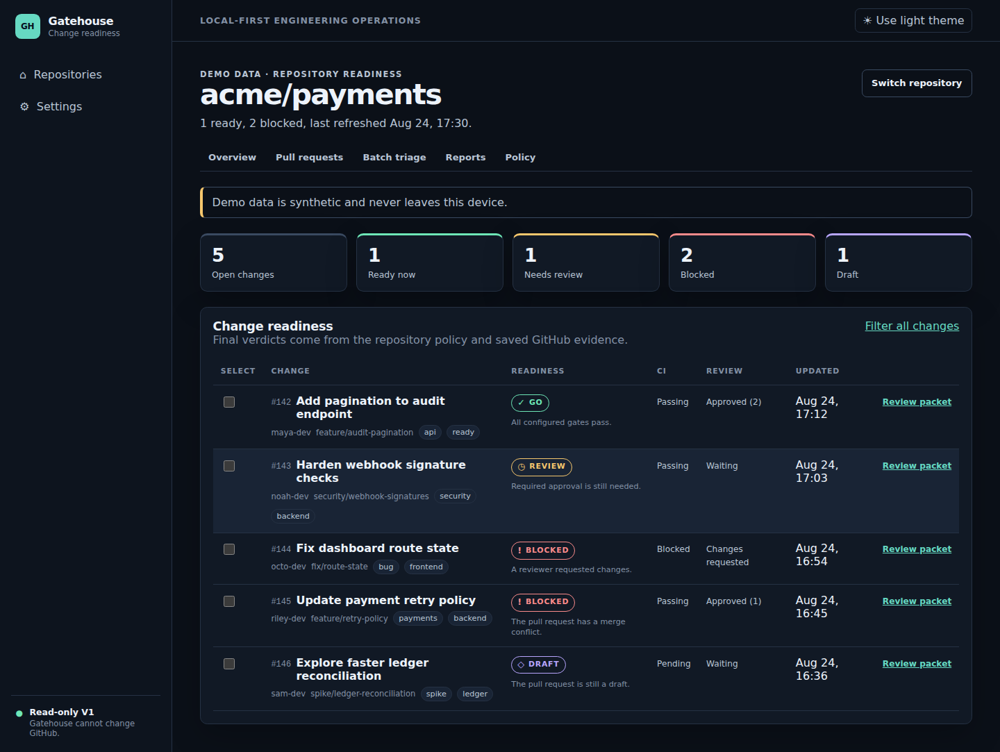

# Gatehouse

Know what is ready to merge, and why.

Gatehouse is a local, read-only GitHub pull request readiness dashboard and command-line tool. It turns branch state, checks, reviews, linked issues, and repository policy into one deterministic verdict: `GO`, `REVIEW`, `BLOCKED`, `DRAFT`, or `UNKNOWN`.



## Why Gatehouse

- One dashboard shows the facts that affect a merge decision.
- The same rules drive the web UI, CLI, reports, and JSON.
- Missing evidence stays `UNKNOWN`. Gatehouse does not guess.
- A local SQLite database keeps the cache on your computer.
- GitHub access is read-only. Gatehouse does not merge, comment, push, or run Git.
- Demo mode uses synthetic data and makes no network request.

## Quick start

Gatehouse 1.0.0 needs the .NET 10 runtime. Put the release `Gatehouse.1.0.0.nupkg` file in a local directory, then install the tool from that directory:

```bash
dotnet tool install --global Gatehouse --version 1.0.0 \
  --add-source ./gatehouse-packages --ignore-failed-sources
gatehouse status --demo
gatehouse serve
```

Open <http://localhost:5341>. Use `Ctrl+C` to stop the server.

### Platform notes

- macOS is the primary local release target. The release gate installs and runs the packed tool on hosted macOS.
- Linux uses the same install and command form. CI also runs the full build, tests, browser flow, and server smoke test on Linux.
- Windows uses the same `dotnet tool install` command in PowerShell. The installed executable is `gatehouse.exe`. The release gate installs and runs it on hosted Windows.
- Each platform needs a supported .NET 10 runtime. Gatehouse does not install .NET for you.

For a public repository:

```bash
gatehouse repo add dotnet/runtime
gatehouse status dotnet/runtime
```

GitHub limits requests that do not use a token. Private repositories need a read-only token. See [GitHub authentication](docs/GITHUB_AUTH.md).

```bash
export GATEHOUSE_GITHUB_TOKEN="your-token"
gatehouse repo add OWNER/REPOSITORY
```

Do not put a token in a Gatehouse command, config file, or repository.

## Use from source

The repository pins the .NET 10 SDK in `global.json`.

```bash
dotnet restore Gatehouse.slnx --locked-mode
dotnet build Gatehouse.slnx --configuration Release --no-restore
dotnet run --project src/Gatehouse.Cli -- status --demo
dotnet run --project src/Gatehouse.Cli -- serve
```

See [local development](docs/LOCAL_DEVELOPMENT.md) for all checks.

## Readiness policy

Gatehouse uses safe defaults. Add `.gatehouse.yml` to the directory where you run the CLI when a repository needs different rules:

```yaml
readiness:
  require_linked_issue: false
  require_all_checks: true
  require_approval: true
  require_no_unresolved_threads: true
  require_mergeable: true
  require_current_branch: false
  block_on_changes_requested: true
```

See the [readiness model](docs/READINESS_MODEL.md) and [policy reference](docs/POLICY.md).

## Documentation

- [Architecture](ARCHITECTURE.md)
- [CLI reference](docs/CLI.md)
- [GitHub authentication](docs/GITHUB_AUTH.md)
- [Privacy](docs/PRIVACY.md)
- [Security](SECURITY.md)
- [Contributing](CONTRIBUTING.md)
- [Changelog](CHANGELOG.md)

## Limits

- Gatehouse is a local decision aid. GitHub branch protection remains the authority.
- V1 reads GitHub.com. It does not support GitHub Enterprise Server.
- The local database is not encrypted by Gatehouse.
- macOS and Windows package smoke checks prove basic portability. The full browser and server test runs on Linux.

## License

Gatehouse is available under the [MIT License](LICENSE).
